# Plan: Flujos Conversacionales WhatsApp - Pausiva

## Contexto del Negocio

Pausiva ofrece acompañamiento integral a mujeres con menopausia desde tres perspectivas:

- **Logística**: Facilitación del acceso a servicios
- **Sintomatología**: Manejo de síntomas físicos
- **Emocional**: Soporte psicológico y bienestar

**Pilares de Valor**: Consulta ginecológica/nutricional/psicológica, seguimiento sintomatológico, gestión digital centralizada, y educación sobre menopausia.

**Tono del Agente**: Conversacional, amable, empático, comprensivo, con enfoque en acompañamiento. NO es médico, NO diagnostica, NO prescribe. Solo ofrece recomendaciones generales de autocuidado.

---

## Variables del Esquema de Base de Datos

### Tablas Principales

- `users`: `id` (uuid), `full_name` (text), `phone` (text), `email` (text), `birth_date` (date)
- `patients`: `id` (uuid FK→users.id), `dni` (text), `clinical_profile_json` (jsonb)
- `appointments`: `id` (uuid), `patient_id` (uuid), `doctor_id` (uuid), `type` (enum: `pre_consulta` | `consulta`), `status` (enum: `scheduled` | `completed` | `cancelled` | `no_show` | `rescheduled`), `scheduled_at` (timestamptz), `notes` (text)
- `plans`: `id` (uuid), `appointment_id` (uuid), `plan` (jsonb), `start_date` (date), `end_date` (date)
- `followings`: `id` (uuid), `patient_id` (uuid), `appointment_id` (uuid nullable), `type` (enum: `emotional` | `symptoms` | `medications` | `business` | `other`), `severity_score` (integer 0-10), `is_urgent` (boolean), `summary` (text), `contacted_at` (timestamptz), `message_count` (integer), `transcript_url` (text)
- `memberships`: `id` (uuid), `patient_id` (uuid), `tier` (enum: `basic` | `standard` | `premium`), `status` (enum: `active` | `paused` | `cancelled` | `expired`), `price` (numeric), `start_date` (timestamptz), `end_date` (timestamptz)
- `patient_timeline_events`: `id` (uuid), `patient_id` (uuid), `event_type` (enum: `appointment` | `paraclinic` | `plan` | `followup` | `payment`), `occurred_at` (timestamptz), `summary` (text), `payload` (jsonb)

### Variables de Estado (almacenadas en `patients.clinical_profile_json`)

- `onboarding_state`: `"new"` | `"collecting_info"` | `"scheduling_appointment"` | `"completed"`
- `first_consultation_scheduled`: `boolean`
- `package_offer_sent`: `boolean`
- `package_status`: `"pending"` | `"accepted"` | `"declined"` | `"negotiating"`
- `negotiation_attempts`: `number` (máximo 2)
- `appointment_reminders_sent`: `{appointment_id: {2days: boolean, same_day: boolean}}`
- `daily_followup_active`: `boolean` (se activa después de primera consulta completada)

### Reglas de Negocio Importantes

- **Primera consulta con doctor**: SIEMPRE es presencial (`appointments.type = 'consulta'` y primera vez)
- **Consultas subsecuentes**: Pueden ser virtuales o presenciales según lo determine el doctor
- **Consulta gratuita inicial**: Es una `pre_consulta` que puede ser virtual o presencial, pero la primera consulta real con doctor asignado es siempre presencial

---

## FLUJO 1: Onboarding hasta Primera Consulta Gratuita

### Paso 1.1: Primer Mensaje del Usuario

**Trigger**: `is_new_patient() == true` (no existe registro en `patients` o `followings` para este `phone`)

**Detección**: Usuario envía cualquier mensaje por primera vez

**Query de Verificación**:

```sql
SELECT COUNT(*) FROM followings f
JOIN patients p ON f.patient_id = p.id
JOIN users u ON p.id = u.id
WHERE u.phone = '{phone_number}'
```

**Acción del Agente**:

- Crear registro en `followings` con `type = 'business'`, `contacted_at = now()`
- Actualizar `patients.clinical_profile_json`: `{"onboarding_state": "collecting_info"}`
- **Mensaje principal**:

  ```
  Hola, bienvenida a Pausiva 💜

  Soy tu acompañante en esta etapa de la menopausia. Estoy aquí para ayudarte con todo lo que necesites.

  Para conocerte mejor, ¿podrías contarme tu nombre y cómo te gustaría que te ayude en este momento?
  ```

- **Acción**: `["SEND_MESSAGE"]`

### Paso 1.2: Usuario Proporciona Información

**Trigger**: Usuario responde después del mensaje de bienvenida

**Detección**: `patients.clinical_profile_json->>'onboarding_state' = 'collecting_info'`

**Query de Verificación**:

```sql
SELECT clinical_profile_json FROM patients p
JOIN users u ON p.id = u.id
WHERE u.phone = '{phone_number}'
```

**Acción del Agente**:

- Extraer nombre usando NER o patterns: "me llamo X", "soy X", "mi nombre es X"
- Extraer necesidad/motivo: síntomas mencionados, preocupaciones, preguntas sobre menopausia
- Actualizar `users.full_name = extracted_name`
- Actualizar `patients.clinical_profile_json`: `{"onboarding_state": "scheduling_appointment", "initial_needs": extracted_needs}`
- Crear registro en `followings` con `type = 'business'`, `summary = 'Onboarding: información inicial capturada'`
- **Mensaje principal**:

  ```
  Gracias {users.full_name}, me alegra conocerte 💜

  Entiendo que {resumir necesidad de forma empática}. Tranquila, estamos aquí para acompañarte en todo este proceso.

  Para conocerte mejor y entender cómo podemos ayudarte, te ofrecemos una consulta gratuita. Es una oportunidad para que conozcas nuestro servicio y nuestro equipo de especialistas.

  Agenda tu primera consulta gratuita aquí: [LINK_TAYCAL]

  Es completamente sin costo y es el primer paso para comenzar tu camino hacia el bienestar 🌸
  ```

- **Acción**: `["SEND_MESSAGE", "SCHEDULE_APPOINTMENT_REMINDERS"]`
- Enviar link de Taycal (botón interactivo o link directo con parámetros: `phone={users.phone}`)

### Paso 1.3: Usuario Completa Formulario en Taycal

**Trigger**: Webhook externo de Taycal notifica que se agendó una consulta gratuita

**Payload Esperado**: `{phone_number, appointment_date, appointment_time, appointment_id, doctor_id, appointment_type}`

**Detección**:

```sql
SELECT p.id, p.clinical_profile_json FROM patients p
JOIN users u ON p.id = u.id
WHERE u.phone = '{phone_number}'
AND p.clinical_profile_json->>'onboarding_state' = 'scheduling_appointment'
```

**Acción del Agente**:

- Crear registro en `appointments`:

  ```sql
  INSERT INTO appointments (patient_id, doctor_id, type, status, scheduled_at)
  VALUES ({patient_id}, {doctor_id}, 'pre_consulta', 'scheduled', '{scheduled_at}')
  ```

- Actualizar `patients.clinical_profile_json`: `{"onboarding_state": "completed", "first_consultation_scheduled": true}`
- Crear registro en `patient_timeline_events`:

  ```sql
  INSERT INTO patient_timeline_events (patient_id, event_type, occurred_at, source_table, source_id, summary)
  VALUES ({patient_id}, 'appointment', '{scheduled_at}', 'appointments', {appointment_id}, 'Primera consulta gratuita agendada')
  ```

- Obtener `users.full_name` y `doctors.specialty` para el mensaje
- **Mensaje principal**:

  ```
  ¡Excelente, {users.full_name}! 🎉

  Hemos confirmado tu consulta gratuita para el {appointments.scheduled_at::date} a las {appointments.scheduled_at::time}.

  Esta consulta es completamente gratuita y es una oportunidad para que conozcas nuestro servicio y cómo podemos acompañarte en esta etapa.

  Te esperamos con mucho cariño. Nuestro equipo está preparado para escucharte y responder todas tus preguntas.

  El día de tu consulta te enviaré un recordatorio. Mientras tanto, si tienes alguna pregunta, no dudes en escribirme 💜
  ```

- **Acción**: `["SEND_MESSAGE"]`
- Programar recordatorios automáticos (ver Flujo 2)

---

## FLUJO 2: Recordatorios de Citas

### Paso 2.1: Recordatorio 2 Días Antes

**Trigger**: Cron job diario que corre a las 8:00 AM

**Query de Detección**:

```sql
SELECT a.id, a.scheduled_at, a.type, u.full_name, d.specialty, p.clinical_profile_json
FROM appointments a
JOIN patients p ON a.patient_id = p.id
JOIN users u ON p.id = u.id
JOIN doctors d ON a.doctor_id = d.id
WHERE a.status = 'scheduled'
AND DATE(a.scheduled_at) = CURRENT_DATE + INTERVAL '2 days'
AND (p.clinical_profile_json->'appointment_reminders_sent'->>a.id::text->>'2days')::boolean IS NULL
```

**Acción del Agente**:

- Obtener información de la cita y doctor
- Actualizar `patients.clinical_profile_json`: marcar `appointment_reminders_sent[{appointment_id}].2days = true`
- **Mensaje principal**:

  ```
  Hola {users.full_name} 💜

  Te recordamos que tienes una cita en 2 días:

  📅 Fecha: {appointments.scheduled_at::date}
  ⏰ Hora: {appointments.scheduled_at::time}
  👩‍⚕️ Especialista: {doctors.specialty}
  📍 Tipo: {appointments.type}

  Si necesitas cambiar o cancelar tu cita, avísame con anticipación.

  ¡Te esperamos! 🌸
  ```

- Crear registro en `followings` con `type = 'business'`, `summary = 'Recordatorio: cita en 2 días'`
- **Acción**: `["SEND_MESSAGE"]`

### Paso 2.2: Recordatorio Mismo Día

**Trigger**: Cron job diario que corre a las 8:00 AM

**Query de Detección**:

```sql
SELECT a.id, a.scheduled_at, a.type, u.full_name, d.specialty, p.clinical_profile_json
FROM appointments a
JOIN patients p ON a.patient_id = p.id
JOIN users u ON p.id = u.id
JOIN doctors d ON a.doctor_id = d.id
WHERE a.status = 'scheduled'
AND DATE(a.scheduled_at) = CURRENT_DATE
AND (p.clinical_profile_json->'appointment_reminders_sent'->>a.id::text->>'same_day')::boolean IS NULL
```

**Acción del Agente**:

- Si es consulta gratuita (`appointments.type = 'pre_consulta'`):

  ```
  ¡Hola {users.full_name}! 💜

  Recuerda que tienes tu consulta gratuita HOY a las {appointments.scheduled_at::time}.

  Esta es una oportunidad para conocernos y entender cómo podemos ayudarte. Prepárate con cualquier pregunta o síntoma que quieras compartir.

  ¡Nos vemos pronto! 🌸
  ```

- Si es consulta presencial (`appointments.type = 'consulta'`):

  ```
  ¡Hola {users.full_name}! 💜

  Recuerda que tienes tu consulta presencial HOY:

  📅 {appointments.scheduled_at::date} a las {appointments.scheduled_at::time}
  👩‍⚕️ {doctors.specialty}

  Te recomendamos llegar 10 minutos antes. Si tienes alguna pregunta o necesitas cambiar la hora, avísame con anticipación.

  ¡Te esperamos! 🌸
  ```

- Actualizar `patients.clinical_profile_json`: marcar `appointment_reminders_sent[{appointment_id}].same_day = true`
- Crear registro en `followings` con `type = 'business'`, `summary = 'Recordatorio: cita mismo día'`
- **Acción**: `["SEND_MESSAGE"]`

---

## FLUJO 3: Venta de Plan de Seguimiento Exclusivo S/50 después de Consulta Gratuita

### Paso 3.1: Envío de Oferta de Plan Exclusivo

**Trigger**: Webhook o evento que indica que la consulta gratuita fue completada

**Query de Detección**:

```sql
SELECT a.id, a.patient_id, u.full_name, p.clinical_profile_json
FROM appointments a
JOIN patients p ON a.patient_id = p.id
JOIN users u ON p.id = u.id
WHERE a.type = 'pre_consulta'
AND a.status = 'completed'
AND (p.clinical_profile_json->>'first_consultation_scheduled')::boolean = true
AND (p.clinical_profile_json->>'package_offer_sent')::boolean IS NULL
```

**Acción del Agente**:

- Actualizar `patients.clinical_profile_json`: `{"package_offer_sent": true, "package_status": "pending"}`
- **Mensaje principal**:

  ```
  ¡Hola {users.full_name}! 💜

  Espero que tu consulta gratuita haya sido útil y te hayas sentido escuchada.

  Queremos acompañarte de forma integral en esta etapa. Por eso te ofrecemos nuestro Plan de Seguimiento Exclusivo:

  📋 Plan de seguimiento exclusivo
  💰 S/50 al mes*

  Incluye:
  ✅ Diagnóstico médico ginecológico
  ✅ Plan de tratamiento hormonal
  ✅ Nutrición personalizada para tu etapa hormonal
  ✅ Rutinas físicas suaves para energía, movilidad y peso
  ✅ Acompañamiento psicológico y emocional
  ✅ Masterclasses y talleres de salud femenina
  ✅ Seguimiento constante vía WhatsApp
  ✅ Acceso a la comunidad privada con otras mujeres como tú
  ✅ Acceso a eventos, ofertas y programas exclusivos

  ¿Te gustaría conocer más detalles o tienes alguna pregunta? Responde "Sí" para aceptar o "No" si prefieres pensarlo 💜
  ```

- Crear registro en `followings` con `type = 'business'`, `summary = 'Oferta de Plan Exclusivo S/50 enviada'`
- **Acción**: `["SEND_MESSAGE"]`

### Paso 3.2: Usuario Acepta Plan Exclusivo

**Trigger**: Usuario responde con "sí", "acepto", "quiero", "me interesa", o similar

**Query de Detección**:

```sql
SELECT p.id, p.clinical_profile_json FROM patients p
JOIN users u ON p.id = u.id
WHERE u.phone = '{phone_number}'
AND p.clinical_profile_json->>'package_status' = 'pending'
```

**Acción del Agente**:

- Crear registro en `memberships`:

  ```sql
  INSERT INTO memberships (patient_id, tier, status, price, currency, start_date, auto_renew)
  VALUES ({patient_id}, 'standard', 'active', 50.00, 'PEN', NOW(), true)
  ```

- Actualizar `patients.clinical_profile_json`: `{"package_status": "accepted"}`
- **Mensaje principal**:

  ```
  ¡Excelente decisión, {users.full_name}! 🎉💜

  Estamos muy contentas de tenerte en nuestro Plan de Seguimiento Exclusivo. A partir de hoy comenzamos a trabajar juntas para que te sientas mejor.

  En los próximos días recibirás:
  - Acceso a la comunidad privada
  - Información sobre tu plan personalizado
  - Próximos pasos según lo acordado en tu consulta

  Si tienes alguna pregunta, escríbeme. Estoy aquí para acompañarte en todo momento 🌸
  ```

- Crear registro en `patient_timeline_events`:

  ```sql
  INSERT INTO patient_timeline_events (patient_id, event_type, occurred_at, source_table, source_id, summary)
  VALUES ({patient_id}, 'plan', NOW(), 'memberships', {membership_id}, 'Plan Exclusivo S/50 aceptado')
  ```

- Crear registro en `followings` con `type = 'business'`, `summary = 'Plan Exclusivo aceptado'`
- **Acción**: `["SEND_MESSAGE"]`

### Paso 3.3: Usuario No Acepta - Primera Negociación

**Trigger**: Usuario responde con "no", "no estoy segura", "tal vez después", o similar

**Query de Detección**:

```sql
SELECT p.id, p.clinical_profile_json FROM patients p
JOIN users u ON p.id = u.id
WHERE u.phone = '{phone_number}'
AND p.clinical_profile_json->>'package_status' = 'pending'
```

**Acción del Agente**:

- Actualizar `patients.clinical_profile_json`: `{"package_status": "negotiating", "negotiation_attempts": 1}`
- **Mensaje principal**:

  ```
  Entiendo perfectamente, {users.full_name} 💜

  Sé que tomar decisiones sobre tu salud puede generar dudas. Es completamente normal.

  ¿Hay algo específico que te preocupa o te gustaría saber más sobre el plan exclusivo? Puedo ayudarte a resolver cualquier duda que tengas.

  También podemos hablar sobre opciones de pago o ajustar el plan según tus necesidades. Lo importante es que encuentres lo que mejor se adapte a ti 🌸
  ```

- Crear registro en `followings` con `type = 'business'`, `summary = 'Negociación de Plan Exclusivo: primera intento'`
- **Acción**: `["SEND_MESSAGE"]`

### Paso 3.4: Usuario No Acepta - Segunda Negociación

**Trigger**: Usuario responde después de primera negociación sin aceptar

**Query de Detección**:

```sql
SELECT p.id, p.clinical_profile_json FROM patients p
JOIN users u ON p.id = u.id
WHERE u.phone = '{phone_number}'
AND p.clinical_profile_json->>'package_status' = 'negotiating'
AND (p.clinical_profile_json->>'negotiation_attempts')::integer = 1
```

**Acción del Agente**:

- Actualizar `patients.clinical_profile_json`: `{"package_status": "declined", "negotiation_attempts": 2}`
- **Mensaje principal**:

  ```
  {users.full_name}, entiendo tu decisión 💜

  Queremos que sepas que siempre estarás bienvenida cuando sientas que es el momento adecuado para ti.

  Mientras tanto, seguiré aquí para acompañarte con cualquier pregunta o síntoma que quieras compartir. No estás sola en este proceso.

  Si cambias de opinión o necesitas algo, solo escríbeme. Estaré aquí para ti 🌸
  ```

- Crear registro en `followings` con `type = 'business'`, `summary = 'Plan Exclusivo declinado después de negociación'`
- **Acción**: `["SEND_MESSAGE"]`

### Paso 3.5: Usuario Acepta después de Negociación

**Trigger**: Usuario acepta después de mensaje de negociación

**Query de Detección**: Similar a Paso 3.2 pero con `package_status = 'negotiating'`

**Acción del Agente**: Seguir mismo flujo que Paso 3.2

---

## FLUJO 4: Recordatorio de Citas Presenciales

### Paso 4.1: Recordatorio Mismo Día - Cita Presencial

**Trigger**: Cron job diario que corre a las 8:00 AM

**Query de Detección**:

```sql
SELECT a.id, a.scheduled_at, u.full_name, d.specialty, p.clinical_profile_json
FROM appointments a
JOIN patients p ON a.patient_id = p.id
JOIN users u ON p.id = u.id
JOIN doctors d ON a.doctor_id = d.id
WHERE a.type = 'consulta'
AND a.status = 'scheduled'
AND DATE(a.scheduled_at) = CURRENT_DATE
AND (p.clinical_profile_json->'appointment_reminders_sent'->>a.id::text->>'same_day')::boolean IS NULL
```

**Acción del Agente**:

- **Mensaje principal**:

  ```
  ¡Hola {users.full_name}! 💜

  Recuerda que tienes tu consulta presencial HOY:

  📅 {appointments.scheduled_at::date} a las {appointments.scheduled_at::time}
  👩‍⚕️ {doctors.specialty}

  Te recomendamos llegar 10 minutos antes. Si tienes alguna pregunta o necesitas cambiar la hora, avísame con anticipación.

  ¡Te esperamos! 🌸
  ```

- Actualizar `patients.clinical_profile_json`: marcar `appointment_reminders_sent[{appointment_id}].same_day = true`
- Crear registro en `followings` con `type = 'business'`, `summary = 'Recordatorio: cita presencial mismo día'`
- **Acción**: `["SEND_MESSAGE"]`

**Nota**: Este flujo se ejecuta para TODAS las citas presenciales (`appointments.type = 'consulta'`), incluyendo la primera consulta con doctor que siempre es presencial.

---

## FLUJO 5: Envío de Prescripciones y Próximos Pasos después de Cita

### Paso 5.1: Envío Post-Cita

**Trigger**: Webhook o evento que indica que una cita fue completada

**Query de Detección**:

```sql
SELECT a.id, a.patient_id, a.notes, pl.plan, u.full_name
FROM appointments a
JOIN patients p ON a.patient_id = p.id
JOIN users u ON p.id = u.id
LEFT JOIN plans pl ON pl.appointment_id = a.id
WHERE a.status = 'completed'
AND NOT EXISTS (
  SELECT 1 FROM followings f
  WHERE f.appointment_id = a.id
  AND f.summary LIKE '%Prescripciones enviadas%'
)
```

**Acción del Agente**:

- Obtener datos de `plans.plan` (jsonb) que contiene prescripciones y próximos pasos
- El formato de `plans.plan` puede ser:

  ```json
  {
    "prescriptions": [
      "Terapia Hormonal: Estradiol 1mg/día",
      "Suplemento de Calcio + Vitamina D"
    ],
    "next_steps": "Control en 3 meses. Evaluar respuesta a tratamiento hormonal. Solicitar densitometría ósea."
  }
  ```

- **Mensaje principal**:

  ```
  ¡Hola {users.full_name}! 💜

  Espero que tu consulta haya sido útil. Aquí tienes un resumen de lo acordado:

  💊 Prescripciones:
  {formatear cada prescripción de plans.plan->'prescriptions' con bullet point}
  • {prescripcion_1}
  • {prescripcion_2}

  📋 Próximos pasos:
  {plans.plan->>'next_steps'}

  Si tienes alguna duda sobre tus prescripciones o próximos pasos, no dudes en escribirme. Estoy aquí para acompañarte 🌸
  ```

- Crear registro en `followings` con `type = 'medications'`, `appointment_id = {appointment_id}`, `summary = 'Prescripciones y próximos pasos enviados'`
- Crear registro en `patient_timeline_events`:

  ```sql
  INSERT INTO patient_timeline_events (patient_id, event_type, occurred_at, source_table, source_id, summary)
  VALUES ({patient_id}, 'plan', NOW(), 'plans', {plan_id}, 'Prescripciones y próximos pasos enviados')
  ```

- **Acción**: `["SEND_MESSAGE"]`

**Ejemplo de mensaje**:

```
¡Hola María! 💜

Espero que tu consulta haya sido útil. Aquí tienes un resumen de lo acordado:

💊 Prescripciones:
• Terapia Hormonal: Estradiol 1mg/día
• Suplemento de Calcio + Vitamina D

📋 Próximos pasos:
Control en 3 meses. Evaluar respuesta a tratamiento hormonal. Solicitar densitometría ósea.

Si tienes alguna duda sobre tus prescripciones o próximos pasos, no dudes en escribirme. Estoy aquí para acompañarte 🌸
```

**Nota**: Este flujo se ejecuta después de TODAS las citas completadas (`appointments.status = 'completed'`), tanto virtuales como presenciales.

---

## FLUJO 6: Manejo de Síntomas con Recomendaciones No Médicas

### Paso 6.1: Usuario Reporta Síntomas

**Trigger**: Usuario escribe mensaje mencionando síntomas, malestar, o cómo se siente

**Detección**: Mensaje contiene palabras clave de síntomas (dolor, cansancio, bochornos, insomnio, ansiedad, etc.)

**Acción del Agente**:

- Clasificar nivel de riesgo usando TriageAgent
- Crear registro en `followings`:

  ```sql
  INSERT INTO followings (patient_id, type, severity_score, is_urgent, summary, contacted_at, message_count)
  VALUES ({patient_id}, 'symptoms', {risk_score}, {is_high_risk}, {symptom_summary}, NOW(), 1)
  ```

- **Si riesgo es HIGH (`severity_score >= 80` o `is_urgent = true`)**:

  ```
  {users.full_name}, lo que describes suena serio y requiere atención médica urgente.

  Por favor, contacta a tu servicio de salud local o acude a urgencias lo antes posible.

  Si estás en Perú, puedes llamar a:
  - Emergencias: 105
  - Salud en Casa: 107

  ¿Hay alguien que pueda acompañarte?
  ```

                                - **Acción**: `["SEND_MESSAGE", "OPEN_RISK_ALERT"]`

- **Si riesgo es MEDIUM (`severity_score 40-79`)**:

  ```
  Entiendo que te sientes {resumir síntoma}, {users.full_name} 💜

  Te recomiendo que hables con tu médica sobre esto en los próximos días. Llevar un registro de cómo te sientes puede ser muy útil para tu próxima consulta.

  Mientras tanto, aquí tienes algunas recomendaciones generales de autocuidado que pueden ayudarte:

  {generar recomendaciones según síntomas - ver Paso 6.2}
  ```

                                - **Acción**: `["SEND_MESSAGE", "UPDATE_SYMPTOM_TRACKING"]`

- **Si riesgo es LOW o NONE (`severity_score 0-39`)**:

  ```
  Entiendo cómo te sientes, {users.full_name} 💜

  Es normal experimentar estos síntomas durante la menopausia. No estás sola en esto.

  Aquí tienes algunas recomendaciones generales que pueden ayudarte a sentirte mejor:

  {generar recomendaciones según síntomas - ver Paso 6.2}

  Recuerda que estas son solo recomendaciones generales de autocuidado. Si los síntomas persisten o empeoran, te recomiendo consultar con tu médica.
  ```

                                - **Acción**: `["SEND_MESSAGE", "UPDATE_SYMPTOM_TRACKING"]`

### Paso 6.2: Generación de Recomendaciones No Médicas

**Trigger**: Después de clasificar síntomas (riesgo LOW o MEDIUM)

**Detección**: Síntomas identificados y `followings.severity_score < 80`

**Recomendaciones según tipo de síntoma** (almacenadas en `followings.summary`):

**Para cansancio/fatiga**:

- Descanso: "Asegúrate de descansar lo suficiente. Intenta dormir 7-8 horas cada noche y toma pequeñas pausas durante el día si te sientes agotada."
- Actividad física: "Una caminata suave de 20-30 minutos puede ayudarte a recuperar energía. No necesitas hacer ejercicio intenso, solo moverte un poco."
- Alimentación: "Incluye alimentos ricos en hierro como espinacas, lentejas y frutos secos. También te ayudará mantenerte hidratada."

**Para bochornos/sudoración**:

- Descanso: "Descansa en un ambiente fresco y ventilado. Usa ropa ligera y de algodón."
- Actividad física: "El ejercicio regular puede ayudar a regular tu temperatura corporal. Prueba con yoga o caminatas suaves."
- Alimentación: "Evita alimentos picantes, cafeína y alcohol que pueden empeorar los bochornos. Prefiere alimentos frescos y ligeros."

**Para insomnio**:

- Descanso: "Establece una rutina de sueño. Intenta acostarte y levantarte a la misma hora cada día, incluso los fines de semana."
- Actividad física: "Hacer ejercicio durante el día puede ayudarte a dormir mejor, pero evítalo cerca de la hora de dormir."
- Alimentación: "Evita comidas pesadas y cafeína antes de dormir. Puedes probar con una infusión de manzanilla o valeriana."

**Para ansiedad/estrés**:

- Descanso: "Tómate tiempo para ti. Practica respiración profunda o meditación durante 10 minutos al día."
- Actividad física: "El ejercicio libera endorfinas que ayudan a reducir el estrés. Prueba con yoga, tai chi o simplemente caminar."
- Hobbies: "Dedica tiempo a actividades que disfrutes: leer, escuchar música, cocinar, o cualquier hobby que te relaje."
- Alimentación: "Alimentos ricos en magnesio como nueces, semillas y vegetales de hoja verde pueden ayudar a calmar la ansiedad."

**Para dolores articulares**:

- Descanso: "Descansa las articulaciones cuando sientas dolor, pero también mantén movimiento suave para evitar rigidez."
- Actividad física: "Ejercicios de bajo impacto como natación, yoga o tai chi pueden ayudar a mantener las articulaciones flexibles."
- Alimentación: "Alimentos antiinflamatorios como pescado, nueces, y frutas pueden ayudar. También asegúrate de mantenerte hidratada."

**Mensaje final de recomendaciones**:

```
Recuerda que estas son recomendaciones generales de autocuidado. Si los síntomas persisten, empeoran, o te preocupan, es importante que consultes con tu médica.

Estoy aquí para acompañarte en este proceso. Si necesitas hablar sobre cómo te sientes, escríbeme 💜
```

---

## FLUJO 7: Seguimiento Diario (Check-in Diario a las 7 PM)

### Paso 7.1: Activación del Seguimiento Diario

**Trigger**: Después de que el paciente completa su primera consulta con doctor asignado

**Query de Detección**:

```sql
SELECT a.id, a.patient_id, p.clinical_profile_json
FROM appointments a
JOIN patients p ON a.patient_id = p.id
WHERE a.type = 'consulta'
AND a.status = 'completed'
AND (p.clinical_profile_json->>'daily_followup_active')::boolean IS NULL
```

**Acción del Agente**:

- Actualizar `patients.clinical_profile_json`: `{"daily_followup_active": true}`
- Crear registro en `patient_timeline_events`:
  ```sql
  INSERT INTO patient_timeline_events (patient_id, event_type, occurred_at, source_table, source_id, summary)
  VALUES ({patient_id}, 'followup', NOW(), 'appointments', {appointment_id}, 'Seguimiento diario activado')
  ```

### Paso 7.2: Envío de Check-in Diario

**Trigger**: Cron job diario que corre a las 7:00 PM

**Query de Detección**:

```sql
SELECT p.id, u.full_name, p.clinical_profile_json
FROM patients p
JOIN users u ON p.id = u.id
WHERE (p.clinical_profile_json->>'daily_followup_active')::boolean = true
AND EXISTS (
  SELECT 1 FROM appointments a
  WHERE a.patient_id = p.id
  AND a.type = 'consulta'
  AND a.status = 'completed'
)
AND NOT EXISTS (
  SELECT 1 FROM followings f
  WHERE f.patient_id = p.id
  AND f.type = 'emotional'
  AND DATE(f.contacted_at) = CURRENT_DATE
)
```

**Acción del Agente**:

- **Mensaje principal**:

  ```
  ¡Hola {users.full_name}! 💜

  ¿Cómo estás hoy? Me encantaría saber cómo te has sentido durante el día.

  Recuerda que estoy aquí para acompañarte y escucharte. Comparte conmigo cómo te sientes, cualquier síntoma que hayas notado, o simplemente cómo ha sido tu día.

  Tu bienestar es importante para mí 🌸
  ```

- Crear registro en `followings` con `type = 'emotional'`, `contacted_at = NOW()`, `summary = 'Check-in diario enviado'`, `message_count = 1`
- **Acción**: `["SEND_MESSAGE"]`

### Paso 7.3: Recepción de Respuesta del Usuario

**Trigger**: Usuario responde al check-in diario

**Detección**: Existe un registro en `followings` con `type = 'emotional'` y `DATE(contacted_at) = CURRENT_DATE` y `message_count = 1`

**Query de Verificación**:

```sql
SELECT f.id, f.patient_id, f.summary, u.full_name
FROM followings f
JOIN patients p ON f.patient_id = p.id
JOIN users u ON p.id = u.id
WHERE f.type = 'emotional'
AND DATE(f.contacted_at) = CURRENT_DATE
AND f.message_count = 1
AND p.id = {patient_id}
ORDER BY f.contacted_at DESC
LIMIT 1
```

**Acción del Agente**:

- Analizar respuesta del usuario para identificar: - Estado emocional general - Síntomas mencionados (bochornos, insomnio, cansancio, ansiedad, dolores, etc.) - Nivel de bienestar percibido
- Clasificar nivel de riesgo usando TriageAgent
- Actualizar registro en `followings`:

  ```sql
  UPDATE followings
  SET message_count = message_count + 1,
      summary = {resumen_de_respuesta},
      severity_score = {risk_score},
      is_urgent = {is_high_risk}
  WHERE id = {following_id}
  ```

- Generar recomendaciones no médicas basadas en síntomas identificados (ver Paso 7.4)

### Paso 7.4: Generación de Recomendaciones Personalizadas

**Trigger**: Después de analizar respuesta del usuario en check-in diario

**Detección**: Síntomas identificados en la respuesta

**Acción del Agente**:

- Buscar recomendaciones no médicas según síntomas identificados
- **Recomendaciones basadas en síntomas comunes de menopausia**:

**Si menciona bochornos/sudoración nocturna**:

```
Entiendo que los bochornos pueden ser muy molestos, {users.full_name} 💜

Algunas cosas que pueden ayudarte:
- Mantén tu habitación fresca y ventilada antes de dormir
- Usa ropa de algodón ligera y transpirable
- Evita alimentos picantes, cafeína y alcohol por la tarde/noche
- Prueba técnicas de respiración profunda cuando sientas que viene un bochorno
- Mantén un vaso de agua fría cerca de tu cama

Estos son consejos generales de autocuidado. Si los bochornos son muy frecuentes o intensos, coméntalo con tu médica en tu próxima consulta.
```

**Si menciona insomnio o problemas para dormir**:

```
El insomnio puede ser muy frustrante, {users.full_name} 💜

Algunas recomendaciones que pueden ayudarte:
- Establece una rutina de sueño: acuéstate y levántate a la misma hora
- Crea un ambiente relajante antes de dormir (luz tenue, música suave)
- Evita pantallas al menos 1 hora antes de dormir
- Prueba con una infusión de manzanilla o valeriana
- Haz ejercicio durante el día, pero evítalo cerca de la hora de dormir
- Practica respiración profunda o meditación antes de acostarte

Recuerda que estas son recomendaciones generales. Si el insomnio persiste, es importante que lo comentes con tu médica.
```

**Si menciona cansancio o falta de energía**:

```
El cansancio puede ser agotador, {users.full_name} 💜

Algunas cosas que pueden ayudarte a recuperar energía:
- Asegúrate de descansar lo suficiente, pero también mantén movimiento suave
- Una caminata de 20-30 minutos al día puede ayudar a aumentar tu energía
- Incluye alimentos ricos en hierro: espinacas, lentejas, frutos secos
- Mantente bien hidratada durante el día
- Toma pequeñas pausas durante el día si te sientes agotada
- Prioriza las actividades importantes y delega cuando sea posible

Estas son recomendaciones generales de autocuidado. Si el cansancio es muy intenso o persistente, coméntalo con tu médica.
```

**Si menciona ansiedad o estrés**:

```
Entiendo que la ansiedad puede ser abrumadora, {users.full_name} 💜

Algunas estrategias que pueden ayudarte:
- Practica respiración profunda: inhala por 4 segundos, sostén por 4, exhala por 4
- Dedica tiempo a actividades que disfrutes: leer, escuchar música, cocinar
- El ejercicio suave como yoga o caminar puede ayudar a reducir el estrés
- Alimentos ricos en magnesio pueden ayudar: nueces, semillas, vegetales de hoja verde
- Tómate tiempo para ti cada día, aunque sean 10 minutos
- Considera escribir tus pensamientos en un diario

Recuerda que estas son recomendaciones generales. Si la ansiedad es muy intensa o interfiere con tu vida diaria, es importante que lo comentes con tu médica o psicóloga.
```

**Si menciona dolores articulares o musculares**:

```
Entiendo que los dolores pueden ser molestos, {users.full_name} 💜

Algunas recomendaciones que pueden ayudarte:
- Mantén movimiento suave: ejercicios de bajo impacto como yoga, tai chi o natación
- Aplica calor o frío según lo que te haga sentir mejor
- Estira suavemente las articulaciones cada día
- Alimentos antiinflamatorios pueden ayudar: pescado, nueces, frutas
- Mantente bien hidratada
- Descansa cuando sientas dolor, pero evita estar completamente inactiva

Estas son recomendaciones generales de autocuidado. Si los dolores son intensos o persistentes, es importante que lo comentes con tu médica.
```

**Si menciona cambios de humor o irritabilidad**:

```
Los cambios de humor pueden ser desafiantes, {users.full_name} 💜

Algunas cosas que pueden ayudarte:
- Reconoce y acepta tus emociones sin juzgarte
- Practica técnicas de relajación: respiración profunda, meditación
- Mantén una rutina regular de sueño y alimentación
- El ejercicio regular puede ayudar a estabilizar el humor
- Dedica tiempo a actividades que te traigan alegría
- Habla con alguien de confianza sobre cómo te sientes

Recuerda que estas son recomendaciones generales. Si los cambios de humor son muy intensos o afectan tu vida diaria, es importante que lo comentes con tu médica o psicóloga.
```

**Si la respuesta es positiva o neutral**:

```
Me alegra saber que estás bien, {users.full_name} 💜

Es maravilloso que te sientas así. Recuerda mantener esos hábitos que te hacen sentir bien:
- Continúa con tu rutina de ejercicio suave
- Mantén una alimentación balanceada
- Descansa lo suficiente
- Dedica tiempo a actividades que disfrutes

Seguiré aquí para acompañarte cada día. Si en algún momento necesitas hablar sobre cómo te sientes, no dudes en escribirme 🌸
```

- **Mensaje final**:

  ```
  Recuerda que estas son recomendaciones generales de autocuidado. Si los síntomas persisten, empeoran, o te preocupan, es importante que consultes con tu médica.

  Mañana te escribiré de nuevo para saber cómo estás. Estoy aquí para acompañarte 💜
  ```

- Actualizar `followings.message_count` y `followings.summary` con la respuesta completa
- Crear registro en `patient_timeline_events`:

  ```sql
  INSERT INTO patient_timeline_events (patient_id, event_type, occurred_at, source_table, source_id, summary, payload)
  VALUES ({patient_id}, 'followup', NOW(), 'followings', {following_id}, 'Check-in diario: {resumen}', {jsonb_con_sintomas_y_recomendaciones})
  ```

- **Acción**: `["SEND_MESSAGE", "UPDATE_SYMPTOM_TRACKING"]`

### Paso 7.5: Manejo de Respuestas de Alto Riesgo

**Trigger**: Usuario responde con síntomas de alto riesgo en check-in diario

**Detección**: `followings.severity_score >= 80` o `followings.is_urgent = true`

**Acción del Agente**:

- **Mensaje principal**:

  ```
  {users.full_name}, lo que describes suena serio y requiere atención médica urgente.

  Por favor, contacta a tu servicio de salud local o acude a urgencias lo antes posible.

  Si estás en Perú, puedes llamar a:
  - Emergencias: 105
  - Salud en Casa: 107

  ¿Hay alguien que pueda acompañarte?
  ```

- Actualizar `followings.is_urgent = true`
- Crear alerta en dashboard (marcar `followings.is_urgent = true` para que aparezca en el frontend)
- **Acción**: `["SEND_MESSAGE", "OPEN_RISK_ALERT"]`

---

## Consideraciones Técnicas Generales

### Queries Clave para Verificación de Estado

- **Paciente nueva**: `SELECT COUNT(*) FROM followings f JOIN patients p ON f.patient_id = p.id JOIN users u ON p.id = u.id WHERE u.phone = '{phone}'`
- **Estado de onboarding**: `SELECT clinical_profile_json->>'onboarding_state' FROM patients p JOIN users u ON p.id = u.id WHERE u.phone = '{phone}'`
- **Citas próximas**: `SELECT * FROM appointments WHERE patient_id = '{patient_id}' AND status = 'scheduled' AND scheduled_at > NOW() ORDER BY scheduled_at`
- **Plan activo**: `SELECT * FROM memberships WHERE patient_id = '{patient_id}' AND status = 'active'`
- **Seguimiento diario activo**: `SELECT clinical_profile_json->>'daily_followup_active' FROM patients WHERE id = '{patient_id}'`

### Triggers Externos

- **Webhook de Taycal**: Cuando se agenda una cita (`appointment_scheduled`) - Payload: `{phone_number, appointment_date, appointment_time, appointment_id, doctor_id, appointment_type}`
- **Webhook de Sistema**: Cuando se completa una cita (`appointment_completed`) - Actualizar `appointments.status = 'completed'`
- **Cron Jobs**: - Recordatorios (diario a las 8:00 AM) - Check-in diario (diario a las 7:00 PM)

### Diferenciación de Flujos

- **Flujo 1**: Solo para pacientes nuevas (sin registros en `followings`)
- **Flujo 2**: Para todas las citas (`appointments.status = 'scheduled'`)
- **Flujo 3**: Solo después de consulta gratuita completada (`appointments.type = 'pre_consulta'` AND `status = 'completed'`)
- **Flujo 4**: Para todas las citas presenciales (`appointments.type = 'consulta'`)
- **Flujo 5**: Para todas las citas completadas (`appointments.status = 'completed'`)
- **Flujo 6**: Para cualquier mensaje que mencione síntomas (crear registro en `followings` con `type = 'symptoms'`)
- **Flujo 7**: Para pacientes con seguimiento diario activo (después de primera consulta con doctor completada)

### Registro de Síntomas en Dashboard

Los síntomas se registran en la tabla `followings` con:

- `type = 'symptoms'` o `type = 'emotional'` (para check-ins diarios)
- `severity_score`: 0-10 (clasificación de riesgo)
- `is_urgent`: boolean (para alertas en dashboard)
- `summary`: texto con resumen de síntomas y recomendaciones
- `contacted_at`: timestamp de la interacción
- `message_count`: número de mensajes intercambiados

Estos registros aparecerán en el dashboard del frontend para seguimiento del paciente.

### Tono y Estilo

- Usar emojis moderadamente (💜 🌸 🎉)
- Lenguaje empático y comprensivo
- Validar emociones sin minimizar
- Enfoque en acompañamiento diario, amable y cercano
- Recordar siempre que NO es médico, solo ofrece recomendaciones generales de autocuidado

---

## Diagrama de Flujos Completo

```mermaid
graph TD
    Start([Usuario envía primer mensaje]) --> CheckNewPatient{¿Es paciente nueva?}

    %% FLUJO 1: Onboarding
    CheckNewPatient -->|Sí| F1_1[FLUJO 1.1: Mensaje Bienvenida]
    F1_1 --> F1_1_Action[Crear following type=business<br/>Actualizar onboarding_state=collecting_info]
    F1_1_Action --> F1_2[FLUJO 1.2: Usuario proporciona info]
    F1_2 --> F1_2_Action[Extraer nombre y necesidades<br/>onboarding_state=scheduling_appointment]
    F1_2_Action --> F1_2_Send[Enviar link Taycal<br/>Ofrecer consulta gratuita]
    F1_2_Send --> F1_3[FLUJO 1.3: Usuario agenda en Taycal]
    F1_3 --> F1_3_Action[Crear appointment type=pre_consulta<br/>onboarding_state=completed<br/>Programar recordatorios]
    F1_3_Action --> F1_3_Send[Confirmar cita gratuita]

    %% FLUJO 2: Recordatorios
    F1_3_Action --> F2_Cron[CRON: Diario 8:00 AM]
    F2_Cron --> F2_Check{¿Cita en 2 días?}
    F2_Check -->|Sí| F2_1[FLUJO 2.1: Recordatorio 2 días antes]
    F2_1 --> F2_1_Action[Marcar reminder_sent.2days=true<br/>Crear following]

    F2_Cron --> F2_Check2{¿Cita hoy?}
    F2_Check2 -->|Sí| F2_2[FLUJO 2.2: Recordatorio mismo día]
    F2_2 --> F2_2_Action[Marcar reminder_sent.same_day=true<br/>Crear following]

    %% Cita se completa
    F1_3_Send --> AppointmentDay[Día de la cita]
    AppointmentDay --> AppointmentCompleted{¿Cita completada?}

    %% FLUJO 5: Post-Cita
    AppointmentCompleted -->|Sí| F5_1[FLUJO 5.1: Enviar prescripciones]
    F5_1 --> F5_1_Action[Obtener plans.plan<br/>Formatear prescripciones y próximos pasos]
    F5_1_Action --> F5_1_Send[Enviar resumen de consulta<br/>Crear following type=medications]

    %% FLUJO 3: Venta de Plan
    F5_1_Send --> CheckPreconsulta{¿Es pre_consulta?}
    CheckPreconsulta -->|Sí| F3_1[FLUJO 3.1: Ofrecer Plan S/50]
    F3_1 --> F3_1_Action[package_offer_sent=true<br/>package_status=pending]
    F3_1_Action --> F3_Response{Respuesta usuario}

    F3_Response -->|Acepta| F3_2[FLUJO 3.2: Usuario acepta]
    F3_2 --> F3_2_Action[Crear membership tier=standard<br/>package_status=accepted<br/>Crear timeline event]
    F3_2_Action --> F3_2_Send[Confirmar plan aceptado<br/>Enviar próximos pasos]

    F3_Response -->|Rechaza| F3_3[FLUJO 3.3: Primera negociación]
    F3_3 --> F3_3_Action[package_status=negotiating<br/>negotiation_attempts=1]
    F3_3_Action --> F3_3_Send[Preguntar dudas<br/>Ofrecer opciones de pago]
    F3_3_Send --> F3_Response2{Respuesta usuario}

    F3_Response2 -->|Acepta| F3_5[FLUJO 3.5: Acepta después<br/>de negociación]
    F3_5 --> F3_2_Action

    F3_Response2 -->|Rechaza| F3_4[FLUJO 3.4: Segunda negociación]
    F3_4 --> F3_4_Action[package_status=declined<br/>negotiation_attempts=2]
    F3_4_Action --> F3_4_Send[Mensaje de comprensión<br/>Dejar puerta abierta]

    %% Check si es consulta con doctor
    CheckPreconsulta -->|No, es consulta| F7_Activate[FLUJO 7.1: Activar seguimiento diario]
    F7_Activate --> F7_Activate_Action[daily_followup_active=true<br/>Crear timeline event]
    F3_2_Send --> F7_Activate

    %% FLUJO 7: Seguimiento Diario
    F7_Activate_Action --> F7_Cron[CRON: Diario 7:00 PM]
    F7_Cron --> F7_Check{¿Seguimiento activo<br/>y no enviado hoy?}
    F7_Check -->|Sí| F7_2[FLUJO 7.2: Enviar check-in diario]
    F7_2 --> F7_2_Action[Crear following type=emotional<br/>message_count=1]
    F7_2_Action --> F7_2_Send[¿Cómo estás hoy?]

    F7_2_Send --> F7_3[FLUJO 7.3: Usuario responde]
    F7_3 --> F7_3_Action[Analizar respuesta<br/>Clasificar riesgo con TriageAgent<br/>Actualizar severity_score]
    F7_3_Action --> F7_Risk{¿Nivel de riesgo?}

    F7_Risk -->|HIGH: score≥80| F7_5[FLUJO 7.5: Alto riesgo]
    F7_5 --> F7_5_Action[is_urgent=true<br/>Crear alerta en dashboard]
    F7_5_Action --> F7_5_Send[Mensaje de urgencia<br/>Números de emergencia<br/>OPEN_RISK_ALERT]

    F7_Risk -->|MEDIUM o LOW| F7_4[FLUJO 7.4: Recomendaciones personalizadas]
    F7_4 --> F7_4_Action[Generar recomendaciones según síntomas<br/>Actualizar following summary<br/>Crear timeline event]
    F7_4_Action --> F7_4_Send[Enviar recomendaciones de autocuidado<br/>Mensaje de acompañamiento]

    F7_5_Send --> F7_Loop[Continuar seguimiento diario]
    F7_4_Send --> F7_Loop
    F7_Loop --> F7_Cron

    %% FLUJO 6: Manejo de Síntomas (puede ocurrir en cualquier momento)
    CheckNewPatient -->|No| CheckSymptoms{¿Mensaje menciona<br/>síntomas?}
    CheckSymptoms -->|Sí| F6_1[FLUJO 6.1: Usuario reporta síntomas]
    F6_1 --> F6_1_Action[Clasificar riesgo con TriageAgent<br/>Crear following type=symptoms]
    F6_1_Action --> F6_Risk{¿Nivel de riesgo?}

    F6_Risk -->|HIGH: score≥80| F6_High[Enviar mensaje de urgencia<br/>Números de emergencia<br/>OPEN_RISK_ALERT]
    F6_Risk -->|MEDIUM: 40-79| F6_Med[Recomendar consulta médica<br/>+ Recomendaciones de autocuidado]
    F6_Risk -->|LOW: 0-39| F6_Low[FLUJO 6.2: Recomendaciones<br/>no médicas]

    F6_Low --> F6_2_Action[Generar recomendaciones según<br/>tipo de síntoma:<br/>- Bochornos<br/>- Insomnio<br/>- Cansancio<br/>- Ansiedad<br/>- Dolores]
    F6_2_Action --> F6_2_Send[Enviar recomendaciones personalizadas<br/>UPDATE_SYMPTOM_TRACKING]

    F6_Med --> F6_2_Action

    %% FLUJO 4: Recordatorio Presencial (específico)
    F2_Check2 -->|Sí y type=consulta| F4_1[FLUJO 4.1: Recordatorio<br/>cita presencial]
    F4_1 --> F4_1_Action[Enviar recordatorio con<br/>instrucciones presenciales<br/>Llegar 10 min antes]

    CheckSymptoms -->|No| NormalConversation[Conversación normal<br/>Responder preguntas<br/>Acompañamiento]

    %% Estilos
    classDef onboarding fill:#e1f5ff,stroke:#0288d1,stroke-width:2px
    classDef reminders fill:#fff9c4,stroke:#f9a825,stroke-width:2px
    classDef sales fill:#f3e5f5,stroke:#8e24aa,stroke-width:2px
    classDef postcita fill:#e8f5e9,stroke:#43a047,stroke-width:2px
    classDef symptoms fill:#ffebee,stroke:#e53935,stroke-width:2px
    classDef daily fill:#fce4ec,stroke:#d81b60,stroke-width:2px
    classDef decision fill:#fff3e0,stroke:#fb8c00,stroke-width:3px
    classDef action fill:#f5f5f5,stroke:#616161,stroke-width:1px

    class F1_1,F1_2,F1_3,F1_1_Action,F1_2_Action,F1_2_Send,F1_3_Action,F1_3_Send onboarding
    class F2_1,F2_2,F2_Cron,F2_1_Action,F2_2_Action,F4_1,F4_1_Action reminders
    class F3_1,F3_2,F3_3,F3_4,F3_5,F3_1_Action,F3_2_Action,F3_2_Send,F3_3_Action,F3_3_Send,F3_4_Action,F3_4_Send sales
    class F5_1,F5_1_Action,F5_1_Send postcita
    class F6_1,F6_1_Action,F6_2_Action,F6_2_Send,F6_High,F6_Med,F6_Low symptoms
    class F7_2,F7_3,F7_4,F7_5,F7_Activate,F7_Cron,F7_2_Action,F7_2_Send,F7_3_Action,F7_4_Action,F7_4_Send,F7_5_Action,F7_5_Send,F7_Loop,F7_Activate_Action daily
    class CheckNewPatient,CheckPreconsulta,CheckSymptoms,F2_Check,F2_Check2,F3_Response,F3_Response2,F6_Risk,F7_Risk,F7_Check,AppointmentCompleted decision
```



### Leyenda del Diagrama

**Colores:**

- 🔵 **Azul**: Flujo 1 - Onboarding
- 🟡 **Amarillo**: Flujos 2 y 4 - Recordatorios de Citas
- 🟣 **Morado**: Flujo 3 - Venta de Plan S/50
- 🟢 **Verde**: Flujo 5 - Post-Cita (Prescripciones)
- 🔴 **Rojo**: Flujo 6 - Manejo de Síntomas
- 💗 **Rosa**: Flujo 7 - Seguimiento Diario
- 🟠 **Naranja**: Decisiones y Validaciones

**Puntos Clave del Flujo:**

1. **Entrada Única**: Todo comienza con el mensaje del usuario
2. **Bifurcación Principal**: Paciente nueva vs. paciente existente
3. **Flujos Paralelos**:
   - Recordatorios (CRON 8:00 AM)
   - Check-ins diarios (CRON 7:00 PM)
   - Manejo de síntomas (cualquier momento)
4. **Activadores Críticos**:
   - Completar pre_consulta → Ofrecer Plan S/50
   - Completar consulta → Activar seguimiento diario
   - Cualquier cita completada → Enviar prescripciones
5. **Sistema de Riesgo**: TriageAgent clasifica síntomas en HIGH/MEDIUM/LOW
6. **Persistencia**: Seguimiento diario continúa indefinidamente una vez activado
